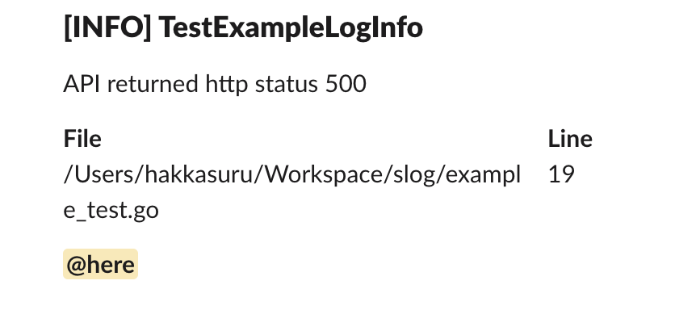

# Slog
Simple Go Slack Logger

# Installation
```shell
go get -u github.com/hakkasuru/slog
```

# Quick Start
```go
config := slog.NewConfig(
    "<webhook url>",
    "TestExampleLogInfo",
    "<!here>",
)
logger := slog.NewSlackLogger(config)
logger.Info(fmt.Sprintf("API returned http status %d", 500))
```
